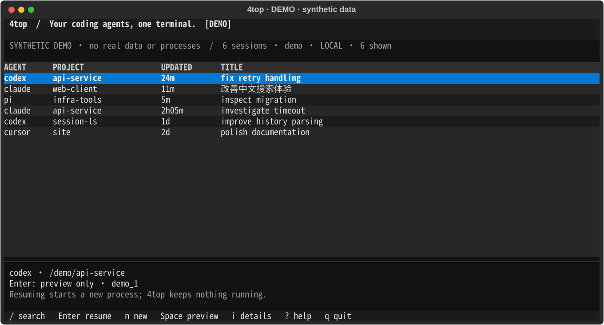

# 4top

**Your coding agents, one terminal.**

Find your work. Resume an exact native session. Reach your other machines over SSH.
A keyboard-first terminal dashboard built on **session-ls**, with no extra 4top
daemon, account, model calls, or telemetry.

[中文](README.zh-CN.md) · [Compatibility](docs/compatibility.md) · [Remote hosts](docs/remote-design.md) · [Acceptance](docs/validation/README.md)



> **0.2.0a1 — alpha.** The current development line owns no process and drives no
> multiplexer of its own. Codex **0.155.1** passed an authenticated exact-resume
> smoke check against an earlier build;
> Claude Code, Pi and other native versions are not certified.
> [Evidence](docs/validation/macos-0.1.0a2.md). It is on PyPI as a pre-release: `uv tool install 4top`.

## Install

macOS or Linux; **Python 3.11+**. No multiplexer is required. Current validation
records, rather than this minimum target, determine which versions were tested.
Windows users need a Linux environment such as WSL; native Windows is unsupported.

```sh
uv tool install 4top            # alpha, so a pre-release
pip install --pre 4top          # pip needs --pre for a pre-release
```

`session-ls`, the parser this builds on, is an ordinary dependency on PyPI. A pip
mirror may lag behind for a new project: if `4top` seems not to exist, add
`--index-url https://pypi.org/simple`, or wait for the mirror to sync.

```sh
4top --demo                     # isolated synthetic demo, no real history
```

### From this checkout

```sh
git clone https://github.com/4ier/4top.git
cd 4top
python3 -m venv .venv
.venv/bin/python -m pip install ./packages/session-ls .
.venv/bin/4top --demo
```

`session-ls`, the parser this builds on, is a separate project with its own
repository and pipeline ([4ier/session-ls](https://github.com/4ier/session-ls)); a
checkout installs it from PyPI like any other dependency. The root wheel contains
only `fourtop`, and `session-ls` keeps its small, stdlib-only CLI.

```sh
. .venv/bin/activate
4top                       # browse every session on this machine
4top new codex             # start an agent here, in this terminal
4top --host build-box      # view another machine over ssh
```

4top never installs or authenticates agents for you. Install the original Claude
Code, Codex, or Pi CLI separately and keep its existing authentication flow.
The panel also reads Cursor transcripts, but does not launch or resume Cursor.

## The daily loop

Open `4top` and you get every session on the machine, most recent first. Select a
row and press **Enter**: 4top asks for confirmation and then runs the native CLI
in this terminal to resume that exact session. Leave the agent and you are back in
the panel. **`q` closes only the panel.**

A plain terminal or any multiplexer you already run is equally fine: 4top starts
the agent in the terminal it was launched from and never allocates a terminal of
its own. If you want a session to survive closing your laptop, run 4top inside the
multiplexer you already use.

| Key | Action |
| --- | --- |
| `↑` / `↓`, `Enter` | Select and resume |
| `H` | Switch the panel between this machine and a configured host |
| `/`, `Enter`, `Esc` | Search metadata, return to table, clear/cancel |
| `Ctrl-F` | Explicit literal full-content search; `Esc` cancels |
| `Space`, `i` | Read-only preview, details |
| `n`, `r`, `?` | New agent, refresh, help |
| `q`, `Ctrl-C` | Close only the panel |

Search supports case-insensitive words and quoted phrases; all terms must match.
Full search decodes JSON text, including Chinese escaped as `\u....`. It reads
only configured sources, reports partial scans, and never executes transcript
content. The UI renders titles and previews as plain, sanitized text.

## Sessions, not processes

A native agent is a file. `pi --session <path>`, `claude --resume <id>` and
`codex resume <id>` all work from the transcript alone, so the transcript is the
thing 4top tracks, and the process is the ephemeral part.

**Resume** starts a new native process from an exact ID or source path. It cannot
restore lost memory, network connections, shell children, or a destroyed machine.
Resume uses the CLI's **current native configuration**; 4top does not replay the
original launch flags. Review native permissions before sending another task.

Because 4top owns no process it claims nothing about liveness either: a row is a
session you can resume, and that is all it says. Failed queries are reported as
issues and never rendered as an empty machine.

Two consequences worth knowing. A resumed agent is a **new** process; two agents in
one directory still have **no code/worktree isolation**. And `4top new` runs the
agent in the foreground of the terminal you launched it from: outside a multiplexer
it ends with that terminal.

## Remote hosts over SSH

Point 4top at any machine you can already `ssh` into. There is no daemon to
install, no port to open, and no credential store: the remote side is the same
CLI, and the local 4top only runs it.

```toml
# ~/.config/4top/config.toml
[hosts.build-box]
ssh = "me@build-box"                 # any ssh destination, including a tailnet name
# command = "/opt/4top/bin/4top"     # if a non-login PATH does not include 4top
# refresh_seconds = 15.0               # slower than local: each tick is a round trip
# timeout_seconds = 10.0
```

```sh
4top --host build-box              # the whole panel, scoped to that host
4top --host build-box list --json
4top --host me@10.0.0.4 doctor     # an unconfigured target works too
```

Views stay isolated: the default scope is this machine, and a host replaces it
rather than merging machines into one table. `H` switches the panel between them
without leaving it; `--host NAME` starts the panel already scoped. Anything that starts a process runs
**on that host** through `ssh -t`, so the resumed agent lives where its history
lives; the remote CLI does the work and the local side only hands over the
terminal. Connection reuse (`ControlMaster`) keeps refreshes cheap, `BatchMode`
means a missing key fails fast instead of prompting, and a remote that speaks a
different row schema is refused instead of partially parsed.

Before it hands over the terminal, the panel asks the host that owns the session
whether the resume can work there (`4top check`). A host without that agent
installed, or a session whose directory is gone, is reported in the panel instead
of failing during the hand-over, where the message would be painted over. The ssh
connection also keeps a liveness probe, so a link that dies becomes an error rather
than a hang, and the session stays in its transcript to be resumed again.

## Command line

```sh
4top list --json                          # one JSON object per row
4top list --agent pi --project 4top
4top search 'retry "database timeout"'    # metadata match
4top search '中文' --full                  # decoded full-content search
4top preview h_<key>                      # one bounded read-only page
4top check h_<key> --json                 # would a resume work here, and why not
4top new codex -- --model MODEL           # native arguments after --
4top resume h_<key> --yes                 # restore this process as the agent
4top doctor --json
```

`doctor` also reports `revision`, and `4top --host NAME doctor` reports it for both
sides, so a remote running older code is visible instead of failing later. Bring a
remote forward with `scripts/remote_update.py NAME`; it uses the host's own egress
first and falls back to a tunnel from this machine.

`--config`, `--host` and `--no-color` work before or after the subcommand.
`check` exits 0 when the session can resume here and 3 when it cannot. Keys
may be shortened only when their prefixes are unambiguous (at least four
characters). Row numbers are never execution targets. `list --json` rows carry
`schema_version`, `key`, `agent`, `host`, `cwd`, `title`, `started`, `last`,
`source`, `status` and `can_resume`.

## Configuration and privacy

Optional configuration: `$XDG_CONFIG_HOME/4top/config.toml` (default
`~/.config/4top/config.toml`). No setup file is needed for standard stores.

```toml
[ui]
refresh_seconds = 1.0
history_refresh_seconds = 5.0
color = "auto"                         # or "none"; NO_COLOR is also supported

[history]
metadata_max_bytes = 2097152
metadata_max_lines = 2000
preview_max_lines = 200

[agents.codex]
# root = "/absolute/path/to/codex-home"
# executable = "/absolute/path/to/a-real-wrapper"
```

Agent store roots respect `CODEX_HOME`, `CLAUDE_CONFIG_DIR`, and
`PI_CODING_AGENT_DIR`; an explicit configured root wins. Selected history and
launch profile must agree. Local state is private: `$XDG_STATE_HOME/4top` holds a
local identity and your last selection, and `$XDG_CACHE_HOME/4top` holds
rebuildable metadata. No environment values, prompt text, or transcripts are
retained. The only network access is the ssh you configured.

[Privacy](docs/privacy.md) · [Troubleshooting](docs/troubleshooting.md) · [Design](docs/design.md)

## Develop and contribute

```sh
.venv/bin/python -m pip install -e ./packages/session-ls -e '.[dev]'
.venv/bin/python -m pytest
.venv/bin/python -m ruff check .
uv tool install --force --editable .   # optional: `4top` runs this checkout
```

Tests use private temporary HOME/state directories and synthetic agents; the ssh
tests use a fake `ssh` on `PATH`. No account credentials, network access or model
calls are required. Record your OS, Python and native CLI versions when reporting
compatibility. **Never post raw transcripts or tokens.**

For fresh installation, CI, reproducible demo export, native smoke testing, and
release gates, see [CONTRIBUTING](CONTRIBUTING.md) and the [acceptance guide](docs/validation/README.md).

4top builds on 4ier's `session-ls` parsers and uses Textual. It is not affiliated
with the vendors of the supported coding agents. **MIT licensed.**
