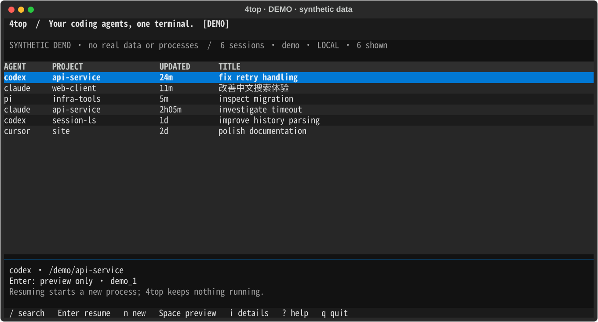

# 4top

**Your coding agents, one terminal.**

Find your work. Resume an exact native session. Reach your other machines over SSH.
A keyboard-first terminal dashboard built on **session-ls**, with no extra 4top
daemon, account, model calls, or telemetry.

[中文](README.zh-CN.md) · [Compatibility](docs/compatibility.md) · [Remote hosts](docs/remote-design.md) · [Phone or tablet](docs/mobile.md) · [Acceptance](docs/validation/README.md)



> **0.2.0a9 — alpha.** With tmux installed, 4top keeps its list beside the agents it
> opens; it records nothing about them and asks tmux what is open. Codex **0.155.1**
> passed an authenticated exact-resume smoke check against an earlier build;
> Claude Code, Pi and other native versions are not certified.
> [Evidence](docs/validation/macos-0.1.0a2.md). It is on PyPI as a pre-release: `uv tool install 4top`.

## Install

macOS or Linux; **Python 3.11+**. No multiplexer is required. Current validation
records, rather than this minimum target, determine which versions were tested.
Windows users need a Linux environment such as WSL; native Windows is unsupported.

```sh
uv tool install 4top            # alpha, so a pre-release
pip install --pre 4top          # pip needs --pre for a pre-release
```

`session-ls`, the parser this builds on, is an ordinary dependency on PyPI. A pip
mirror may lag behind for a new project: if `4top` seems not to exist, add
`--index-url https://pypi.org/simple`, or wait for the mirror to sync.

```sh
4top --demo                     # isolated synthetic demo, no real history
```

### From this checkout

```sh
git clone https://github.com/4ier/4top.git
cd 4top
python3 -m venv .venv
.venv/bin/python -m pip install .
.venv/bin/4top --demo
```

`session-ls`, the parser this builds on, is a separate project with its own
repository and pipeline ([4ier/session-ls](https://github.com/4ier/session-ls)); a
checkout installs it from PyPI like any other dependency. The root wheel contains
only `fourtop`, and `session-ls` keeps its small, stdlib-only CLI.

```sh
. .venv/bin/activate
4top                       # browse every session on this machine
4top new codex             # start an agent here, in this terminal
4top --host build-box      # view another machine over ssh
```

4top never installs or authenticates agents for you. Install the original Claude
Code, Codex, or Pi CLI separately and keep its existing authentication flow.
The panel also reads Cursor transcripts, but does not launch or resume Cursor.

## The daily loop

Open `4top` and you see **Now**: every machine's sessions of this week in one list,
most urgent first: `‼ needs you` (an agent is blocked on a permission prompt or a
question, read from its screen on its host), `✓ done` (finished since you last
opened or peeked it), `⟳ working`, `✗ stopped`,
then the rest of the week. Muted, scripted (`claude -p`, `codex exec`) and subagent
sessions stay out of it; `/` searches everything. `g` switches to one section per
machine, each with its own page. Select
a session and press **Enter**. The machine that owns it checks that it can resume
there, and the agent opens. There is no confirmation dialog, and a refusal (a
missing CLI, a directory that is gone) appears in the list instead.

With **tmux** installed, 4top runs in a tmux server of its own and opens each agent
beside the list, like files beside an editor's file tree. Opening another session
keeps the first one running in the background; `●` marks the open ones, and Enter
on one shows it again. `Alt-←` / `Alt-→` (or `→` in the list, or a click) move
between the list and the agent. On a narrow screen, such as a phone, the focused
side fills the screen. **`q` detaches**: the agents keep running, and running `4top`
again brings everything back. `Q` closes them all, except that an agent kept on a
remote host (below) only loses this view.

Without tmux, or with `layout = "plain"`, Enter runs the agent in this terminal and
the list returns when it exits.

| Key | Action |
| --- | --- |
| `↑` / `↓`, `Enter` | Select, open (or show, if it is already open) |
| `g` | Switch between Now (every machine, most urgent first) and one section per machine |
| `v`, `c` | Peek at a running agent's screen and reply there; reply in one line |
| `y`, `d` | Approve or deny the permission prompt an agent is waiting on |
| `n` | New task: machine, recent project, agent, what to do; kept on its host (with `[cloud]`, also a sandbox) |
| `R`, `x`, `X` | Name a session; mute it, or its whole project, from Now |
| `→`, `Alt-←` / `Alt-→` | Move to the agent / between list and agent (tmux layout) |
| `[` / `]`, `f` | Previous / next page and fold (per-machine view) |
| `/`, `Enter`, `Esc` | Search everything, return to the list, clear search and filters |
| `p`, `A` | Show one project; show scripted and subagent sessions too |
| `Ctrl-F` | Explicit literal full-content search; `Esc` cancels |
| `Space`, `i` | Latest messages (read-only; `e` for earlier), details |
| `r`, `?` | Refresh, help |
| `q`, `Q`, `Ctrl-C` | Detach (tmux) or quit; close all agents and quit |

Each row says what the session is doing, from the end of its transcript: `⟳ working`
while the agent is mid-turn, `▶ your turn` once it has handed the turn back, and
`✗ stopped` for a turn that went silent for ten minutes. A session whose agent is
running on its host, as that host's tmux says, is marked `○` when this panel is not
showing it, and is never called stopped: a long tool call is silence, not a stop.
A third line, `› …`, is
your latest request when it differs from how the session began, and the git branch
joins the project. Badges are shown for the last day only; older sessions are history.

Sessions an agent started for itself (Codex's approval reviewer, spawned workers)
are hidden until you press `a`. The preview opens at the latest messages, where the
conversation is, rather than at the injected context a transcript begins with.

Search supports case-insensitive words and quoted phrases; all terms must match.
Full search decodes JSON text, including Chinese escaped as `\u....`. It reads
only configured sources, reports partial scans, and never executes transcript
content. The UI renders titles and previews as plain, sanitized text.

## Sessions, not processes

A native agent is a file. `pi --session <path>`, `claude --resume <id>` and
`codex resume <id>` all work from the transcript alone, so the transcript is the
thing 4top tracks, and the process is the ephemeral part.

**Resume** starts a new native process from an exact ID or source path. It cannot
restore lost memory, network connections, shell children, or a destroyed machine.
Resume uses the CLI's **current native configuration**; 4top does not replay the
original launch flags. Review native permissions before sending another task.

4top keeps no record of processes either. In the tmux layout a pane is tagged with
the session it runs, and `●` means tmux has that pane now; `○` likewise means the
host's own tmux has that agent now. Nothing else is remembered. Failed queries are reported as issues and never rendered as an empty
machine.

Two consequences worth knowing. A resumed agent is a **new** process; two agents in
one directory still have **no code/worktree isolation**. Outside the tmux layout,
`4top new` runs the agent in the foreground of this terminal and ends with it.

## Remote hosts over SSH

Point 4top at any machine you can already `ssh` into. There is no daemon to
install, no port to open, and no credential store: the remote side is the same
CLI, and the local 4top only runs it.

```toml
# ~/.config/4top/config.toml
[hosts.build-box]
ssh = "me@build-box"                 # any ssh destination, including a tailnet name
# command = "/opt/4top/bin/4top"     # if a non-login PATH does not include 4top
# refresh_seconds = 15.0               # slower than local: each tick is a round trip
# timeout_seconds = 10.0
```

```sh
4top                               # this machine and every configured host
4top --host build-box              # the panel, scoped to that host only
4top --host build-box list --json
4top --host me@10.0.0.4 doctor     # an unconfigured target works too
```

Each configured host gets its own section of the list, refreshed on its own
interval and incrementally, so an unchanged host costs a few hundred bytes. The
last rows seen are cached, so a host shows at once and then catches up; one that
cannot be reached keeps its rows and says so. Anything that starts a process runs
**on that host** through `ssh -t`, so the resumed agent lives where its history
lives; the remote CLI does the work and the local side only hands over the
terminal. Connection reuse (`ControlMaster`) keeps refreshes cheap, `BatchMode`
means a missing key fails fast instead of prompting, and a remote that speaks a
different row schema is refused instead of partially parsed.

Before it hands over the terminal, the panel asks the host that owns the session
whether the resume can work there (`4top check`). A host without that agent
installed, or a session whose directory is gone, is reported in the panel instead
of failing during the hand-over, where the message would be painted over.

**Agents stay on their host.** With tmux installed there, the host runs the agent in
a tmux server of its own (`4top-agents`, apart from yours), and the panel's ssh
connection only attaches to it (`4top attach`). A dropped link, a killed terminal
app or a closed panel detaches; the agent keeps working. Opening the session again,
from the same device or another one, attaches to the same process instead of
starting a second. That server has no status line and no prefix key, so every key
reaches the agent. The ssh connection keeps a liveness probe, so a link that dies
becomes "Disconnected" in about 45 seconds rather than a hang. A host running an
older 4top is resumed as before, and on a host without tmux the agent lives in the
ssh session, as before. Sessions of this machine still open in the panel's own
layout, but one already kept here (opened from another device) is attached rather
than started a second time.

## Notifications on your phone

Opt-in, per host, and without a daemon: the agents already call out when they need
you or finish, and `4top notify --install` points those calls at 4top, which sends
one message to an [ntfy](https://ntfy.sh) topic your phone subscribes to.

```sh
4top notify --install     # wire this host's agents; prints the topic to subscribe to
4top notify --test        # one test message
4top notify --uninstall   # remove exactly what --install added
```

Without a configured topic, `--install` makes a random one on the public ntfy.sh and
records it as `[notify] url` in this host's configuration; `--url` names your own
(a self-hosted server, or the same topic on every host). In the ntfy Android app, tap
**+** and subscribe to the topic it prints. Run it on each host: every host's hooks
send from that host. `--agent claude` (repeatable) wires or unwires only the agents
named.

A message is titled `host · project` and says the state, as the panel names it,
with what the agent said and your latest request:

- **Needs you (permission / question)**, high priority: Claude Code asked to run a
  tool or asked you something (its `Notification` hook); a Pi extension prompt.
- **Done**: the turn ended (Claude Code `Stop`, Codex `notify`, Pi `agent_settled`).
  Codex tells a notify program only about finished turns, so Codex is never "needs you".
- **Error**: the turn failed (Claude Code `StopFailure`, a Pi error).

What is wired: hooks in Claude Code's `settings.json`, Codex's top-level `notify`
program in `config.toml` (a notify program Codex already had keeps running: 4top
calls it first), and an extension file in Pi's `extensions/`. Each file is copied to
`*.4top-backup` before the first change; entries 4top did not write are never touched.
A hook returns at once and sends from a detached process with a five-second limit,
so an unreachable server never holds up or fails the agent. Repeats are dropped: the
same message about a session within ten minutes, or any within twenty seconds unless
it newly needs you. Sessions started by a script (`claude -p`, `codex exec`) or by
another agent are not reported, as far as the host's session-ls can tell them apart,
and neither is a session you muted, or one in a project you muted (`4top mute`).

On a public server the topic is the only secret: anyone who knows it can read the
messages (host and project names, the request and the agent's last words) and send to
it. Tapping a notification opens ntfy, not Termux: ntfy opens links, and Termux
registers no link that would open it (only a broadcast to an automation app such as
Tasker could).
## Cloud tasks (E2B)

The home machines do the work; when they are asleep or busy, a task can go to the
cloud: an [E2B](https://e2b.dev) sandbox of its own, started from anywhere,
including a tablet, since it needs only a repository URL.

```sh
4top cloud new claude "fix the flaky retry test" --repo 4ier/app --ref main
4top cloud ls                      # state, cost so far, lifetime left, today's spending
4top cloud open app                # watch or talk to its agent
4top cloud done app --pr           # push branch 4top/app, open a pull request, end the sandbox
4top cloud pause app
4top cloud rm app                  # refused while its work is not on 4top/app; --discard
```

A task is a repository, a ref and a prompt. The sandbox clones the repository
itself, on a new branch `4top/NAME`, and the agent starts on the prompt in the
sandbox's own agent tmux, as on any host that keeps agents. It works with nobody
attached, and Enter on its row in the panel attaches with `4top attach`. Its
outcome is the pushed branch. `done` commits what the agent left, pushes it, keeps
a snapshot of the sandbox for `keep_snapshot_days`, and kills the sandbox. Run
inside a clone, `new` defaults to that clone's origin and branch *as pushed*;
what is only on the device does not travel.

Costs have caps. A sandbox never runs past `max_minutes`; at the deadline it
pauses, with its work kept, and only `done` or `rm` may wake it after that. A task
that could take today's spending past `daily_budget_usd` is refused before anything
is created. Spending is read from E2B's own record of when each 4top sandbox ran,
from every device, priced at E2B's published rates ($0.000014 per vCPU-second,
$0.0000045 per GiB-second, as read on 2026-09-30). That makes it an estimate: E2B's
invoice is the authority. A paused sandbox cannot be woken by traffic, so a refresh
never costs anything. Only an action you take, such as opening it, wakes it.

```toml
[cloud]                   # its presence also lists live tasks in the panel
template = "4top"         # built from contrib/e2b
max_minutes = 60
daily_budget_usd = 5.0
keep_snapshot_days = 7
```

Credentials come from the device that starts the task and go to that task only.
They are an E2B key (`E2B_API_KEY`, or `e2b auth login`), a GitHub token (`GH_TOKEN`,
`GITHUB_TOKEN` or `gh auth token`) and the agent's own. For Claude that is
`CLAUDE_CODE_OAUTH_TOKEN` from `claude setup-token` (or
`~/.config/claude-code/oauth-token`) or `ANTHROPIC_API_KEY`; for Codex,
`OPENAI_API_KEY` or `auth.json`. The GitHub token is handed to git for the clone and
the push and never written down. The agent's credentials live in its process only,
and `done` stops the agent and deletes them before the snapshot. The E2B key never
enters a sandbox. The ssh public key is how the device gets in, and `websocat` is
needed here (`brew install websocat`, `pkg install websocat`). In a sandbox the
agent runs without asking before each command; the sandbox holds nothing but the
task.

A sandbox can also be pinned as a host. Refreshing never wakes it, and opening a
row wakes it for the rest of its lifetime:

```toml
[hosts.scratch]
e2b = "SANDBOX_ID"
```

Design: [docs/e2b-design.md](docs/e2b-design.md).

## Command line

```sh
4top list --json                          # one JSON object per row
4top list --agent pi --project 4top
4top search 'retry "database timeout"'    # metadata match
4top search '中文' --full                  # decoded full-content search
4top preview h_<key>                      # one bounded read-only page
4top preview h_<key> --tail               # the latest messages instead
4top check h_<key> --json                 # would a resume work here, and why not
4top new codex -- --model MODEL           # native arguments after --
4top resume h_<key> --yes                 # restore this process as the agent
4top attach h_<key>                       # the agent in this host's own tmux; started if needed
4top new codex --resident                 # a new agent kept there too
4top notify --install                     # push notifications through ntfy (above)
4top new claude --cwd ~/code/app --prompt 'fix the flaky test' --resident
4top projects --json                      # recent project directories here, for a picker
4top peek h_<key>                         # a kept agent's screen, without attaching
4top send h_<key> 'yes, and add a test'   # type into it, then Enter
4top approve h_<key>                      # answer its permission prompt yes
4top deny h_<key>                         # or no
4top label h_<key> 'nightly migration'    # name a session; no name clears it
4top mute --project ~/code/bots           # keep a project's sessions out of Now
4top unmute --project ~/code/bots         # and back
4top doctor --json
```

**Talking to a kept agent.** `peek`, `send`, `approve` and `deny` work on an agent
kept in this host's own tmux, so a phone can read it and answer it without taking
over a terminal; with `--host` they run on that host. `peek` reads its screen
(`--lines N`, `--json`); `send` pastes the text as one piece and presses Enter
(`--no-enter` does not; text that starts with a dash goes after `--`). `approve`
and `deny` press what the prompt on screen offers (Claude Code: `1` / Esc; Codex:
`y` / Esc), and refuse with exit 4, pressing nothing, when no permission prompt is
there now, so a stale tap never types into an agent that moved on. A session with no
agent kept here exits 3.

`doctor` also reports `revision`, and `4top --host NAME doctor` reports it for both
sides, so a remote running older code is visible instead of failing later. Bring a
remote forward with `scripts/remote_update.py NAME`; it uses the host's own egress
first and falls back to a tunnel from this machine.

`--config`, `--host` and `--no-color` work before or after the subcommand.
`check` exits 0 when the session can resume here and 3 when it cannot. Keys
may be shortened only when their prefixes are unambiguous (at least four
characters). Row numbers are never execution targets. `list --json` rows carry
`schema_version`, `key`, `agent`, `host`, `cwd`, `title`, `started`, `last`,
`source`, `status`, `can_resume` and `resident` (an agent for it runs in this host's
own tmux now), and what the host says beyond the transcript: `attention`
(`permission` or `question`: a kept agent's screen shows it waiting on you),
`label` and `muted` (yours, from `label` and `mute`), `repo` (the repository, the
same for every worktree of it) and `changes` (`files`, `insertions`, `deletions`,
`untracked`, `dirty`: git's answer for sessions of the last week).

## Configuration and privacy

Optional configuration: `$XDG_CONFIG_HOME/4top/config.toml` (default
`~/.config/4top/config.toml`). No setup file is needed for standard stores.

```toml
[ui]
refresh_seconds = 1.0
history_refresh_seconds = 5.0
color = "auto"                         # or "none"; NO_COLOR is also supported
layout = "auto"                        # "tmux" (require it), "plain", or auto
rows_per_host = 0                      # sessions per machine page; 0 fits the screen
update_check = true                    # daily PyPI check; shows how to upgrade

[history]
metadata_max_bytes = 2097152
metadata_max_lines = 2000
preview_max_lines = 200

[agents.codex]
# root = "/absolute/path/to/codex-home"
# executable = "/absolute/path/to/a-real-wrapper"
# args = ["--dangerously-bypass-approvals-and-sandbox"]   # added to every launch

[agents.claude]
# args = ["--dangerously-skip-permissions"]

[notify]                               # written by `4top notify --install`
# url = "https://ntfy.sh/4top-<random>"  # the topic is the secret
# events = ["needs-you", "done", "error"]
# name = "mac"                         # the machine in each title; default its host name
```

`args` are added to every start and resume of that agent, for example a permission
mode. They are yours to choose: 4top's default adds nothing, and arguments that
would change which session is resumed are refused. For a remote host, set them in
that host's own configuration, because the remote 4top builds the command.

Agent store roots respect `CODEX_HOME`, `CLAUDE_CONFIG_DIR`, and
`PI_CODING_AGENT_DIR`; an explicit configured root wins. Selected history and
launch profile must agree. Local state is private: `$XDG_STATE_HOME/4top` holds a
local identity, your last selection, and the names and mutes you gave sessions
(`marks.json`), and `$XDG_CACHE_HOME/4top` holds rebuildable metadata, including
git's last answer per worktree. No environment values, prompt text, or transcripts are
retained. Network access is the ssh you configured, plus the daily update check,
plus, once you install notifications, one POST to your ntfy topic per message.

[Privacy](docs/privacy.md) · [Troubleshooting](docs/troubleshooting.md) · [Design](docs/design.md)

## Develop and contribute

```sh
.venv/bin/python -m pip install -e '.[dev]'
.venv/bin/python -m pytest
.venv/bin/python -m ruff check .
uv tool install --force --editable .   # optional: `4top` runs this checkout
```

Tests use private temporary HOME/state directories and synthetic agents; the ssh
tests use a fake `ssh` on `PATH`. No account credentials, network access or model
calls are required. Record your OS, Python and native CLI versions when reporting
compatibility. **Never post raw transcripts or tokens.**

For fresh installation, CI, reproducible demo export, native smoke testing, and
release gates, see [CONTRIBUTING](CONTRIBUTING.md) and the [acceptance guide](docs/validation/README.md).

4top builds on 4ier's `session-ls` parsers and uses Textual. It is not affiliated
with the vendors of the supported coding agents. **MIT licensed.**
